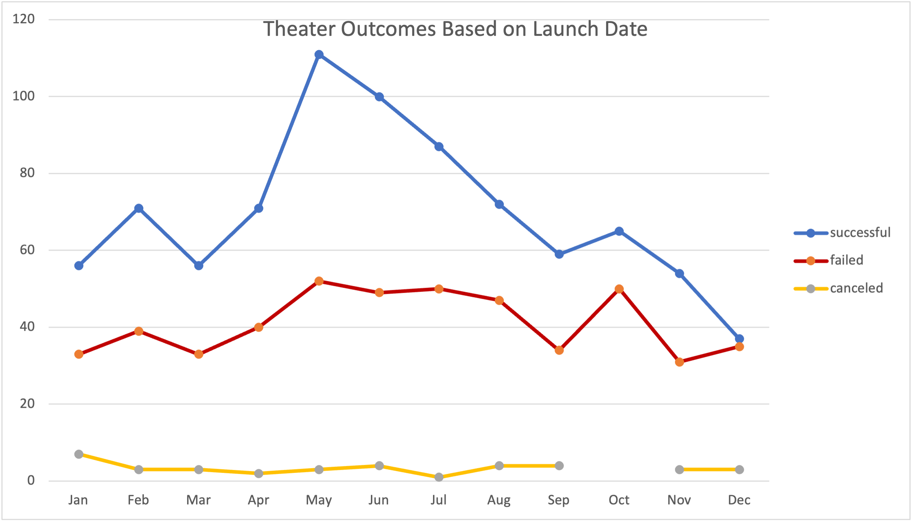

# Kickstarting with Excel

## Overview of Project

### Purpose

This analysis examines several Kickstarter campaigns to determine if the time of year or the goal has an impact on the success of a campaign.

## Analysis and Challenges

### Analysis of Outcomes Based on Launch Date

### Analysis of Outcomes Based on Goals

### Challenges and Difficulties Encountered

## Results

### Outcomes Based on Launch Date

Successful campaigns rose from March and hit an all-time high in May. One could assume from this observation that more theater campaigns succeed when launched during the Spring months in order to make production for the busy summer season ahead. 

Comparing the success rate of theater campaigns as a whole, it seems if one creates a Kickstarter campaign in this category it is more likely to succeed than fail.

### Outcomes Based on Goals

There's no real sweet spot when it comes to the success of plays meeting their Kickstarter funding goal. Based on the data presented, play campaigns are more successful at lower goals while they are less successful at higher goals.

### Limitations

This dataset is limited as we are measuring the success of theater campaigns as a whole while breaking them up by genre would give us a better of understanding of what we could do with the data. Some campaigns may fail as the genre doesn't resonate with the target audience or vise versa.

### Other Possible Tables/Graphs

If we were to dive into this dataset more, it would be beneficial to measure outcomes based on country. This would visualized through a line graph where we could determine whether or not the country has an effect on the success of each campaign category.
